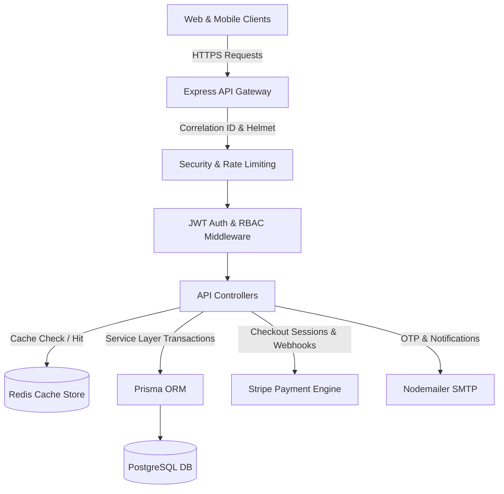

# 🛒 NexusCommerce API

<p align="center">
  
  
  
  
  
  
  
  
  
</p>

> **NexusCommerce API** is a modern, high-performance, modular enterprise e-commerce backend built with TypeScript, Express.js, Prisma ORM (PostgreSQL), Redis intelligent caching, and Stripe payment processing.

---

## 📑 Table of Contents
- [✨ Key Features](#-key-features)
- [🏗️ System Architecture](#️-system-architecture)
- [📁 Project Structure](#-project-structure)
- [🚀 Quick Start](#-quick-start)
- [⚙️ Environment Configuration](#️-environment-configuration)
- [📖 API Endpoints Reference](#-api-endpoints-reference)
- [💳 Stripe Payment Workflow](#-stripe-payment-workflow)
- [🛡️ Security & Authentication](#️-security--authentication)
- [🧪 Testing & Quality Assurance](#-testing--quality-assurance)
- [📜 License](#-license)

---

## ✨ Key Features

* **🔐 Authentication & Security**
  * JWT Access + Refresh token rotation with HttpOnly cookies & Bearer header support.
  * Role-based Access Control (RBAC) supporting `USER` and `ADMIN` roles.
  * CSRF Double Submit Cookie validation with timing-safe comparisons.
  * Rate-limiting per IP backed by Redis with sliding windows.
  * Password hashing via `bcrypt`, input validation via `Zod`, and XSS sanitization.
  * Google OAuth2.0 authentication integration.
  * 2FA (Two-Factor Authentication) via email OTP verification.

* **📦 Catalog, Inventory & Restock Alerts**
  * Multi-tier product filtering (price min/max, categories, tags, rating, stock status).
  * Fast full-text search with Redis query caching and automated cache invalidation.
  * Instant search suggestions & facet aggregation endpoints.
  * Admin low-stock inventory alerts (`/inventory/low-stock`) & bulk restock pipeline.
  * Soft delete / hide product visibility controls.
  * Automatic inventory deduction and stock replenishment on cancellation.

* **🏠 Customer Address Book & Wishlists**
  * Multi-shipping address management with default address auto-selection.
  * Customer wishlist with 1-click migration into active cart.

* **🏷️ Coupons & Promotions Engine**
  * Percentage-based & flat discount coupon validation.
  * Minimum order amount thresholds and maximum discount ceilings.
  * Usage frequency limits and expiration date enforcement.

* **🛒 Shopping Cart & Orders**
  * Persistent database shopping carts with live stock checks.
  * Atomic Prisma transactions for order placement and checkout.
  * Order status state machine (`PENDING` ➔ `PAID` ➔ `SHIPPED`).

* **💳 Payment Integration**
  * Stripe Checkout Session creation with itemized product lines and metadata.
  * Webhook listener (`/payment/webhook`) with cryptographic signature validation.

* **📊 Business Intelligence & Health Diagnostics**
  * Admin sales analytics: Total revenue, completed orders count, Average Order Value (AOV), top products.
  * Real-time system telemetry: Database & Redis latency checks, memory RSS/heap tracking.

---

## 🏗️ System Architecture



---

## 📁 Project Structure

```text
ecommerce-express-api/
├── .github/
│   └── workflows/ci.yml       # GitHub Actions CI/CD Pipeline
├── prisma/
│   └── schema.prisma          # Prisma ORM schema & entity relations
├── docs/
│   └── openapi.json           # OpenAPI 3.0 API specifications
├── src/
│   ├── config/                # Centralized typed environment configs
│   ├── controllers/           # HTTP Request handlers
│   │   ├── authControllers/   # Login, 2FA, OAuth, Register
│   │   ├── Product-Controller.ts
│   │   ├── Cart-Controller.ts
│   │   ├── Order-Controller.ts
│   │   ├── Coupon-Controller.ts
│   │   ├── Wishlist-Controller.ts
│   │   ├── Address-Controller.ts
│   │   ├── Inventory-Controller.ts
│   │   └── Payments-Controller.ts
│   ├── database/              # Business logic & Prisma data access
│   ├── errors/                # Standardized custom error classes
│   ├── middleware/            # Auth, CSRF, Rate Limiting, RequestID
│   ├── routes/                # Express API Route definitions
│   ├── schemas/               # Zod validation schemas
│   ├── types/                 # TypeScript typings
│   ├── utils/                 # Logging, JWT, Email & Response wrappers
│   ├── app.ts                 # Express application pipeline
│   └── index.ts               # Server entry point
├── .env.example               # Environment variables template
├── docker-compose.yml         # Container configuration (Postgres & Redis)
├── Dockerfile                 # Production multi-stage Docker build
└── package.json               # Dependencies and scripts
```

---

## 🚀 Quick Start

### 1. Clone & Install Dependencies
```bash
git clone <your-repo-url>
cd ecommerce-express-api
npm install
```

### 2. Configure Environment
```bash
cp .env.example .env
# Edit .env with your PostgreSQL, Redis, and Stripe credentials
```

### 3. Spin Up Infrastructure (Docker)
```bash
docker-compose up -d
```

### 4. Run Prisma Migrations
```bash
npx prisma generate
npx prisma migrate dev --name init
```

### 5. Start Development Server
```bash
npm run dev
```
The server will start at `http://localhost:3000` with health check at `http://localhost:3000/healthz`.

---

## 📖 API Endpoints Reference

| Method | Endpoint | Description | Access |
| :--- | :--- | :--- | :--- |
| `GET` | `/healthz` | System uptime & health status | Public |
| `GET` | `/api/v1/health/detailed` | Database & Redis latency diagnostics | Public |
| `POST` | `/api/v1/auth/register` | Register customer account | Public |
| `POST` | `/api/v1/auth/login` | Authenticate & issue tokens | Public |
| `POST` | `/api/v1/auth/logout` | Revoke session & clear cookies | Auth |
| `POST` | `/api/v1/auth/refresh` | Rotate access & refresh tokens | Public |
| `GET` | `/api/v1/product` | Paginated product listings | Public |
| `GET` | `/api/v1/product/featured` | Top-rated featured products | Public |
| `GET` | `/api/v1/product/search?q=`| Search product catalog | Public |
| `GET` | `/api/v1/product/search/suggestions?q=`| Autocomplete suggestions | Public |
| `GET` | `/api/v1/product/facets` | Category counts & price boundaries | Public |
| `POST` | `/api/v1/product` | Create product listing | Admin |
| `PATCH`| `/api/v1/product/:id` | Update product details | Admin |
| `DELETE`| `/api/v1/product/:id`| Remove product listing | Admin |
| `GET` | `/api/v1/inventory/low-stock` | Low stock inventory alerts | Admin |
| `PATCH`| `/api/v1/inventory/restock` | Replenish product inventory | Admin |
| `GET` | `/api/v1/cart` | View active cart | Auth |
| `POST` | `/api/v1/cart` | Add item / update quantity | Auth |
| `DELETE`| `/api/v1/cart/:id` | Remove item from cart | Auth |
| `GET` | `/api/v1/wishlist` | View saved wishlist items | Auth |
| `POST` | `/api/v1/wishlist` | Save product to wishlist | Auth |
| `POST` | `/api/v1/wishlist/:id/move-to-cart` | Transfer wishlist item to cart | Auth |
| `GET` | `/api/v1/address` | View saved shipping addresses | Auth |
| `POST` | `/api/v1/address` | Add new address | Auth |
| `GET` | `/api/v1/address/default` | Get default shipping address | Auth |
| `GET` | `/api/v1/coupons` | List promo codes & discounts | Public |
| `POST` | `/api/v1/coupons/apply` | Apply coupon code to cart | Auth |
| `POST` | `/api/v1/orders` | Place new order from cart | Auth |
| `GET` | `/api/v1/orders/user` | View user order history | Auth |
| `GET` | `/api/v1/orders/analytics/summary` | Admin sales metrics | Admin |
| `POST` | `/api/v1/payment/checkout` | Create Stripe checkout session | Auth |
| `POST` | `/api/v1/payment/webhook` | Stripe event listener | Stripe |

---

## 🧪 Testing & Quality Assurance

```bash
# Run unit & integration tests
npm test

# Run tests with coverage reports
npm run test:coverage

# TypeScript compile validation
npm run lint

# Production build bundle
npm run build
```

---

## 📜 License

This project is licensed under the MIT License.
